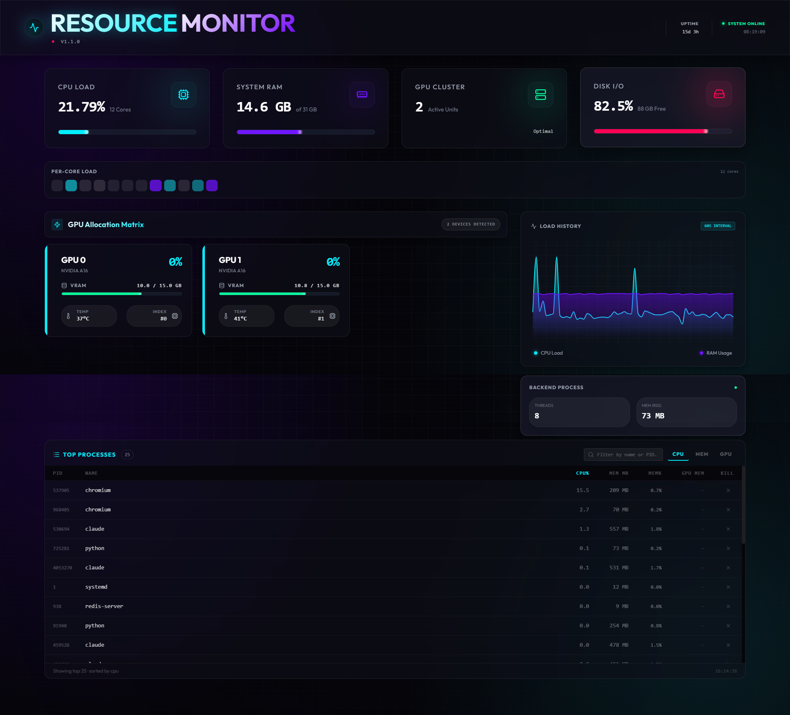

# Resource Monitoring Dashboard For Linux

A real-time system resource monitoring dashboard for linux, tracking CPU, RAM, Disk, GPU usage, and running processes. The backend (Python/FastAPI) streams live stats over Server-Sent Events and serves the React frontend as static files, so the whole app runs as a single service.

> **Platform support: Linux only (officially).** The backend relies on `psutil.disk_usage("/")`, which assumes a Unix-style root filesystem, and production deployment (`resource-dash.service`) is a systemd unit that also shells out to `nvidia-smi`. It will likely run for local dev on Windows via `python main.py` (FastAPI/uvicorn/psutil are cross-platform, and the GPU collector has a Windows WMI fallback), but this is untested and unsupported — expect rough edges around disk stats and no systemd-based deployment path.

<!-- TODO: add screenshot -->



## Project Structure

```
.
├── app/                          # Modularized FastAPI backend
│   ├── app.py                    # Application factory
│   ├── collectors/               # Resource metric collectors
│   │   ├── cpu.py
│   │   ├── ram.py
│   │   ├── disk.py
│   │   ├── gpu.py
│   │   └── processes.py
│   ├── core/                     # Core configuration and logging
│   │   ├── config.py
│   │   └── logging.py
│   └── routers/                  # API endpoint handlers
│       ├── resources.py          # Resource stats endpoints
│       └── stream.py             # Streaming endpoints
├── frontend/                     # React dashboard (git submodule)
└── main.py                       # Server entry point
```

## Quick Start (Local Development)

### Backend Setup

1. Create a virtual environment:

   ```bash
   python -m venv .venv
   source .venv/bin/activate
   ```
2. Install Python dependencies:

   ```bash
   pip install -r requirements.txt
   ```
3. Set up environment variables:

   ```bash
   cp .env.example .env
   ```

   Edit `.env` if you need to override any defaults.
4. Build the frontend:

   ```bash
   cd frontend
   pnpm install
   pnpm build
   cd ..
   ```
5. Run the server:

   ```bash
   python main.py
   ```

   The dashboard will be available at `http://localhost:8202`

## Configuration

Available environment variables (see `.env.example`):

- `PORT`: Server port (default: 8202)
- `HOST`: Server host (default: 127.0.0.1)
- `RELOAD`: Enable uvicorn auto-reload on code changes (default: False)

## API Endpoints

- `GET /`: Serves the React dashboard (index.html)
- `GET /api/v1/resources/stats`: Current system resource usage (JSON)
- `GET /api/v1/resources/stats/stream`: Real-time resource stats stream (Server-Sent Events)
- `GET /api/v1/resources/health`: Monitoring service health check

## Frontend

The React dashboard is included as a git submodule. To work with it:

```bash
# Update the submodule
git submodule update --init --recursive

# Rebuild frontend after changes
cd frontend && pnpm build && cd ..
```

The backend automatically serves the built frontend files when available. See [frontend/README.md](./frontend/README.md) for frontend-specific development instructions (dev server, structure, env vars).
