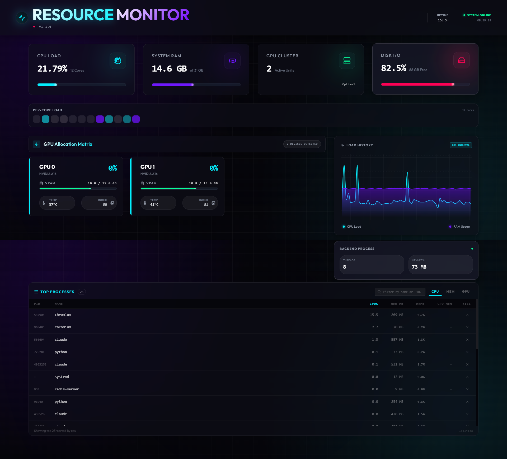

# AI Resource Monitoring Dashboard

A real-time system resource monitoring dashboard, tracking CPU, RAM, Disk, GPU usage, and running processes. The backend (Python/FastAPI) streams live stats over Server-Sent Events and serves the React frontend as static files, so the whole app runs as a single service.

> **Platform support: Linux and Windows.** `python main.py` runs natively on both (FastAPI/uvicorn/psutil are cross-platform, `psutil.disk_usage` works with both `/` and `C:\`-style paths, and the GPU collector has a Windows WMI fallback for non-NVIDIA cards). The Docker Compose setup (host PID namespace + root filesystem bind mount) targets Linux hosts; on Windows it runs inside Docker Desktop's Linux VM rather than monitoring the Windows host directly. systemd-based deployment (`resource-dash.service`) is Linux-only.

<!-- TODO: add screenshot -->



## Quick Start (Docker)

The whole app — frontend build + backend — runs as a single container.

**Prerequisites:**

- [Docker](https://docs.docker.com/engine/install/) with the Compose plugin (`docker compose version`)
- An NVIDIA GPU with drivers installed on the host — **optional**. Without it the dashboard still runs fine, just with GPU panels reporting "unavailable".
- **NVIDIA Container Toolkit** — only needed if you want GPU stats. On Ubuntu/Debian:

  ```bash
  curl -fsSL https://nvidia.github.io/libnvidia-container/gpgkey | sudo gpg --dearmor -o /usr/share/keyrings/nvidia-container-toolkit-keyring.gpg
  curl -s -L https://nvidia.github.io/libnvidia-container/stable/deb/nvidia-container-toolkit.list | sed 's#deb https://#deb [signed-by=/usr/share/keyrings/nvidia-container-toolkit-keyring.gpg] https://#g' | sudo tee /etc/apt/sources.list.d/nvidia-container-toolkit.list
  sudo apt-get update && sudo apt-get install -y nvidia-container-toolkit
  sudo nvidia-ctk runtime configure --runtime=docker
  sudo systemctl restart docker
  ```

  For other distros, see [NVIDIA&#39;s install guide](https://docs.nvidia.com/datacenter/cloud-native/container-toolkit/latest/install-guide.html).

**Run it:**

```bash
git clone --recurse-submodules <this-repo-url>
cd resource-dashboard

# Without GPU stats:
docker compose up -d --build

# With GPU stats (toolkit installed above):
docker compose -f docker-compose.yml -f docker-compose.gpu.yml up -d --build
```

The dashboard will be available at `http://localhost:8202`.

The container monitors the **host** machine, not itself: it shares the host's PID namespace (process/CPU stats) and mounts the host's root filesystem read-only at `/host` (disk stats), so the numbers you see match what you'd get running the app directly on the host.

## Project Structure

```
.
├── app/                          # Modularized FastAPI backend
│   ├── app.py                    # Application factory
│   ├── collectors/               # Resource metric collectors
│   │   ├── cpu.py
│   │   ├── ram.py
│   │   ├── disk.py
│   │   ├── gpu.py
│   │   └── processes.py
│   ├── core/                     # Core configuration and logging
│   │   ├── config.py
│   │   └── logging.py
│   └── routers/                  # API endpoint handlers
│       ├── resources.py          # Resource stats endpoints
│       └── stream.py             # Streaming endpoints
├── frontend/                     # React dashboard (git submodule)
└── main.py                       # Server entry point
```

## Quick Start (Local Development)

### Backend Setup

Dependencies are managed with [uv](https://docs.astral.sh/uv/). See [RUN.md](./RUN.md) for full step-by-step setup on Windows and Linux.

1. Install dependencies (creates `.venv` automatically):

   ```bash
   uv sync
   ```
2. Set up environment variables:

   ```bash
   cp .env.example .env
   ```

   Edit `.env` if you need to override any defaults.
3. Build the frontend:

   ```bash
   cd frontend
   pnpm install
   pnpm build
   cd ..
   ```
4. Run the server:

   ```bash
   uv run python main.py
   ```

   The dashboard will be available at `http://localhost:8202`

## Configuration

Available environment variables (see `.env.example`):

- `PORT`: Server port (default: 8202)
- `HOST`: Server host (default: 127.0.0.1)
- `RELOAD`: Enable uvicorn auto-reload on code changes (default: False)

## API Endpoints

- `GET /`: Serves the React dashboard (index.html)
- `GET /api/v1/resources/stats`: Current system resource usage (JSON)
- `GET /api/v1/resources/stats/stream`: Real-time resource stats stream (Server-Sent Events)
- `GET /api/v1/resources/health`: Monitoring service health check

## Frontend

The React dashboard is included as a git submodule. To work with it:

```bash
# Update the submodule
git submodule update --init --recursive

# Rebuild frontend after changes
cd frontend && pnpm build && cd ..
```

The backend automatically serves the built frontend files when available. See [frontend/README.md](https://github.com/blackstargit/resource-dashboard-frontend/blob/main/README.md) for frontend-specific development instructions (dev server, structure, env vars).
